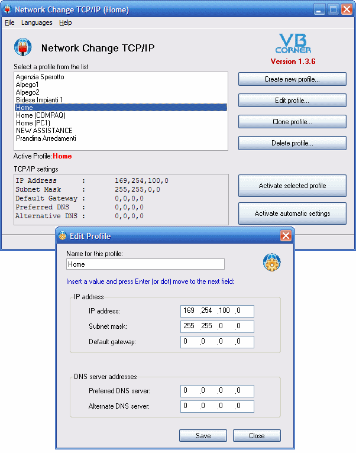



## Network Change TCP/IP

### Description

The NC project intend to help developers that have to change the TCP/IP parameters protocoll frequently to connect to different network server (LAN).

It is a paranoia insert 'by hand' this parameters each time, when you change company (network lan).

The concept is simple: NC use a "profile" to keep all network parameters; you can use many profiles (no limit to this!).

When you have to connect to a Lan, activate the appropriate profile. Go to other company? Active the relative profile! Finally, when you return to home, you can activate the Home profile or reset to DHCP, that is: "Obtain automatic IP and DNS address.

If you modify, bug-fix or enhanced this project I will grant to inform me about this changes, so I can update the project on my web site, for other users.

NC support: tray icon, auto-run on Windows startup, multi-language (italian, english and deutsch, by now), multi network cards,...

Thank to Mario Raccagni for your technical support, and Roberto Doretto for the enhanced support to choose more than one network cards!

----

IMPORTANT

Thank to the HIDEONSTARTUP parameter, you can load NC on startup and see the tray icon only.

Right click to the icon open the NC menu.
 
### More Info
 

             |
---                |---
**Submitted On**   |2006-03-06 00:27:02
**By**             |[gibra](https://github.com/Planet-Source-Code/PSCIndex/blob/master/ByAuthor/gibra.md)
**Level**          |Advanced
**User Rating**    |5.0 (80 globes from 16 users)
**Compatibility**  |VB 6\.0
**Category**       |[Complete Applications](https://github.com/Planet-Source-Code/PSCIndex/blob/master/ByCategory/complete-applications__1-27.md)
**World**          |[Visual Basic](https://github.com/Planet-Source-Code/PSCIndex/blob/master/ByWorld/visual-basic.md)
**Archive File**   |[Network\_Ch197885382006\.zip](https://github.com/Planet-Source-Code/gibra-network-change-tcp-ip__1-64587/archive/master.zip)

